<div align="center">

# इशारा · Ishaara

### From signs to shared understanding.

**A low-cost, hands-free communication bridge for sign language users.**

[](#project-status)
[](#why-ishaara)
[](#hardware)

</div>

---

## The communication gap

For millions of Deaf and Hard-of-Hearing people, everyday communication still depends on whether an interpreter or sign-language-aware person is available. That support cannot realistically be present for every conversation, classroom, clinic, shop, journey, or emergency.

Most technology addresses only half of the exchange: it translates signs into text or speech, but gives the Deaf user no equally natural way to receive the hearing person's reply.

**Ishaara is being designed to close that gap.**

It combines a clip-on camera module with a companion phone app to translate signed gestures into speech. Its longer-term architecture adds speech-to-caption translation, creating a genuinely two-way communication loop.

> Ishaara does not claim to invent sign recognition—or assume that sign language is universal. It focuses on making assistive communication affordable, wearable, hands-free, and adaptable to different sign languages and communities.

## How it works

```mermaid
flowchart LR
    A[Deaf user signs] --> B[Clip-on camera]
    B -->|Wi-Fi video stream| C[Companion app]
    C --> D[Pose landmarks]
    D --> E[Sequence classifier]
    E --> F[Recognized text]
    F --> G[Text-to-speech]
    G --> H[Hearing listener]

    H -. Future: spoken reply .-> I[Speech-to-text]
    I -.-> J[Captions for Deaf user]
```



The wearable stays deliberately lightweight: it captures and streams video while the phone handles pose extraction, inference, language processing, and text-to-speech. This keeps the hardware affordable and makes future model updates easier to deliver.

## Why Ishaara?

| Design goal | Ishaara's approach |
|---|---|
| **Affordable** | Target prototype hardware cost of approximately **₹1,200–₹1,800** |
| **Hands-free** | A small module clips onto existing glasses instead of requiring a phone to be held up |
| **Language-adaptable** | Built to support separately trained vocabularies instead of assuming every sign language is the same |
| **Two-way by design** | Sign-to-speech is the MVP; speech-to-caption is the planned return path |
| **Resilient** | Emergency phrases can work without depending on successful ML recognition |
| **Personal** | Custom gesture training can support names, local expressions, and individual signing styles |

## MVP scope

The product roadmap targets the capabilities below. The checked-in working model currently recognizes only `hello` and `thankyou`; it is not unrestricted conversational sign language.

- **Sign → text → speech:** recognizes a scoped set of approximately 50–200 trained signs
- **Fingerspelling mode:** supports words outside the trained vocabulary, letter by letter
- **Emergency gesture:** triggers a preloaded phrase such as “I need help” without relying on the full recognition pipeline
- **Custom gestures:** lets a user record personal signs through the companion app
- **Recognition feedback:** confirms successful recognition through visual or haptic feedback
- **Companion app:** manages streaming, inference, mode selection, training, and speech output

## Software pipeline

1. **Capture** — the ESP32-CAM captures JPEG frames and streams them to the phone over Wi-Fi. During development, the phone camera can also record the same short signing clip directly as a backup capture source.
2. **Pose extraction** — MediaPipe Holistic converts pixels into hand, face, and body landmarks.
3. **Sequence buffering** — the app collects roughly 1–2 seconds of landmarks because a sign is a movement, not a single pose.
4. **Classification** — an LSTM or transformer-based model predicts a trained sign and confidence score.
5. **Text assembly** — recognized signs map to words or phrases.
6. **Speech synthesis** — native mobile text-to-speech produces audio.
7. **Delivery** — the phone speaker or a Bluetooth earpiece plays the translated phrase.

### Expected latency

The target end-to-end delay is approximately **1.5–2.5 seconds in favourable conditions**, with a possible **5–6 second delay** on weaker networks or budget phones. The interface should communicate this state clearly rather than making the user wonder whether recognition failed.

## Hardware

| Component | Purpose | Approx. cost |
|---|---|---:|
| ESP32-CAM (OV2640) | Image capture and wireless streaming | ₹350–₹450 |
| FTDI USB-to-TTL programmer | Firmware flashing; reusable | ₹80–₹200 |
| TP4056 charging module | Safe Li-ion charging | ₹11–₹15 |
| 3.7 V, 500 mAh LiPo battery | Portable power | ₹150–₹250 |
| Micro toggle switch | Physical power control | ₹25 |
| 3D-printed glasses clip | Attachment to existing eyewear | ₹100–₹300 |
| Bluetooth earpiece | Private audio output | ₹300–₹600 |

**Estimated prototype total: ₹1,200–₹1,800**  
Using the phone speaker can reduce a basic build to roughly **₹700–₹1,000**.

## Project status

> [!IMPORTANT]
> Ishaara is currently a prototype concept in active development. The capabilities below are targets, not claims of production readiness or clinical-grade reliability.

| Stage | Goal | Status |
|---|---|---|
| 1 | ESP32-CAM video stream to phone | Planned |
| 2 | Landmark extraction and scoped sign classifier | Working for 2 validated labels |
| 3 | Text-to-speech and emergency phrases | Working in the web app |
| 4 | Companion app and custom gesture flow | Working responsive web MVP with personal gesture enrollment |
| 5 | Speech-to-caption return path | Roadmap |
| 6 | Continuous signing and group conversations | Research roadmap |

> **Current working app:** the Figma-aligned camera MVP combines a scoped team-trained model with device-owned personal gestures. It includes sign-to-text, automatic speech output, two-way conversation, vocabulary management, emergency phrases, settings, and three-example personal-sign enrollment. See [`docs/MVP_DEMO_RUNBOOK.md`](docs/MVP_DEMO_RUNBOOK.md) for the tested scope and [`docs/ADDING_WORDS.md`](docs/ADDING_WORDS.md) for the full-model expansion process.

The deployable interface is mobile-first and responsive: phones receive the full-screen app, while larger displays retain the Figma-designed product context beside it. Accepted translations are spoken immediately using the device's native Web Speech engine, avoiding a second server round trip. Deployment instructions are in [`docs/DEPLOYMENT.md`](docs/DEPLOYMENT.md).

### Create a personal sign

Personal signs are a separate few-shot layer for names and private phrases; they do not pretend to retrain the general classifier instantly.

1. Open **Vocabulary → Create sign**.
2. Enter the name or phrase that should be spoken.
3. Perform the same distinct gesture three times.
4. The browser stores normalized landmark templates on that device. Uploaded enrollment clips are deleted after extraction and are not retained by the recognition server.
5. Perform the gesture through **Recognize one sign**. A strong template match displays and automatically speaks the chosen name or phrase; otherwise the trained model remains the fallback.

### Current ML refinement path

The current checkpoint is a useful baseline, but it must not be treated as proof of accuracy for a new signer or a new capture device. Ishaara therefore keeps two capture routes active:

- **Mobile-video backup:** records a short clip and sends it through the model's video-native landmark pipeline. The clip is deleted immediately after recognition.
- **ESP32 JPEG route:** accepts ordered snapshots at `/api/frames`; this remains the hardware integration route and is not removed while ESP32-CAM work continues.

The backend can also save explicitly consented, labelled ISL recordings through `POST /api/training/captures` for full model refinement. The local preparation and fine-tuning scripts create signer-separated training, validation, and test splits. A refined model is only promoted after it has been evaluated on signers it did not see during training.

### Test the current prototype locally

Start the local review server, then open `http://127.0.0.1:4173/` in a browser:

```powershell
INCLUDE\.venv\Scripts\python.exe local_recognition_server.py
```

For the **live-camera path**, press **Start camera**, allow access to the laptop webcam, then press **Recognize one sign** and perform one sign in the 2.5-second recording window. The clip is processed locally and then deleted. This route uses `POST /api/mobile/recognize`.

For a **phone on the same trusted Wi-Fi network**, bind the server to the LAN and open the laptop's IPv4 address on the phone. The app's **Use phone camera** button uses the native video-capture picker, so it remains available even when browser live-camera access requires HTTPS:

```powershell
$env:ISHAARA_HOST="0.0.0.0"
.\INCLUDE\.venv\Scripts\python.exe local_recognition_server.py
```

Do not expose this development server to the public internet.

For the **ESP32-CAM path**, send ordered JPEG snapshots to `POST /api/frames`, using the same `sequence_id` on each request and `final=true` on the final snapshot. This endpoint remains available while camera firmware work continues.

> [!WARNING]
> The active two-label refinement checkpoint is a scoped MVP, **not** an accurate recognizer for arbitrary ISL vocabulary. Do not demonstrate unsupported words as if the model knows them.

### Build the first accurate scoped ISL model

1. Choose an initial vocabulary of 5–10 signs with guidance from ISL users or interpreters.
2. Collect labelled clips through `POST /api/training/captures` or an offline consented capture workflow. Record around 25–50 examples of each sign per signer, with varied lighting, framing, clothing, and backgrounds. Personal-sign enrollment is deliberately separate from this training dataset.
3. Use at least three signers for every label. One signer's recordings must remain out of training for honest evaluation.
4. Prepare landmarks and signer-separated splits:

   ```powershell
   INCLUDE\.venv\Scripts\python.exe scripts\prepare_isl_training_data.py
   ```

5. Fine-tune the transformer and inspect its held-out-signer metrics:

   ```powershell
   INCLUDE\.venv\Scripts\python.exe scripts\train_isl_refinement.py --data-dir data\isl-training-keypoints --epochs 35
   ```

6. Promote the refined model only after reviewing its per-signer errors and testing it in the same camera setup intended for the product.

Raw recordings and prepared datasets are deliberately ignored by Git. They are local, consented training data rather than public project files. The compact approved two-word checkpoint and its aggregate metrics are checked in so the working MVP is reproducible.

## 24-hour prototype plan

| Time | Focus |
|---|---|
| Hours 0–6 | Flash hardware and establish stable camera streaming |
| Hours 6–14 | Integrate MediaPipe and train a scoped gesture classifier |
| Hours 14–20 | Connect the app, fingerspelling, emergency phrase, and custom gesture flows |
| Hours 20–24 | Add TTS, test end-to-end latency, and polish the demo |

## Roadmap

- **Speech → captions:** display a hearing person's reply for the Deaf wearer
- **Sound awareness:** detect alarms, doorbells, and name-calling, then provide haptic alerts
- **Expanded vocabularies:** move beyond the small MVP set as representative data becomes available for each supported sign language
- **Continuous signing:** progress from isolated signs toward sentence-level recognition
- **Improved hardware:** evaluate higher-frame-rate camera platforms such as the ESP32-P4
- **Multi-person conversations:** distinguish speakers and signers in classrooms, meetings, and groups

## Known limitations

We believe responsible assistive technology starts with honest boundaries.

- Continuous natural sign-language recognition remains an open research problem; the MVP will recognize only a scoped vocabulary.
- The ESP32-CAM is limited to roughly 10 fps at QVGA in this use case, which constrains fast and detailed signing.
- Accuracy will vary with lighting, framing, distance, signer consistency, and the quality and representativeness of training data.
- A 1–2 second sequence buffer is inherent to motion-based recognition, so the experience will be assistive rather than instant.
- Sign-language datasets are limited and uneven across languages and regions. Training data must be identified clearly and must not be presented as transferable proof for a different sign language.
- Native signers, interpreters, and Deaf-community collaborators must remain part of validation; technical metrics alone cannot establish usefulness.

## What makes this worth building

Ishaara aims to make everyday communication possible without requiring a human interpreter to be physically present—using consumer-grade hardware at approximately ₹1,500 instead of assistive devices that can cost lakhs.

The product is meant to serve the Deaf wearer, not merely translate for the hearing person. Recognition feedback, emergency communication, future speech captions, and sound-event alerts are central to that promise.

## Team needs

We are looking for contributors and mentors across:

- **Embedded systems** — ESP32 firmware, streaming, battery, and enclosure design
- **ML / computer vision** — landmark pipelines, temporal classifiers, evaluation, and dataset strategy
- **Mobile engineering** — streaming, on-device inference, TTS, captions, and accessibility
- **Product design** — low-friction interactions for Deaf and hearing participants
- **Sign-language and Deaf-community expertise** — language accuracy, lived-experience validation, and responsible testing

## Contributing

Ishaara is at an early stage, so focused experiments and candid feedback are especially valuable. Before opening a large pull request, start a discussion or issue describing the user need, proposed approach, target sign language, and how it will be tested with its users.

Please do not present performance in one sign language as proof of performance in another. Contributions involving signer data should include clear consent, privacy, storage, and deletion practices.

---

<div align="center">

### इशारा — because communication should never depend on who is available to interpret.

Built with empathy, tested with honesty, and shaped with the Deaf community.

</div>
